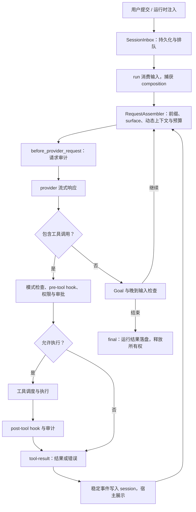

# Cade 架构

Cade 是本地运行的 Python coding-agent harness，负责模型请求组装、工具执行与权限、
会话记录和运行生命周期。编码产品将这些能力装配为 `CadeApp`，TUI、exec、
浏览器工作台和 Python 调用通过应用入口提交任务、消费事件。

本文说明当前实现的组件边界、运行过程、状态归属和扩展位置。安装与使用从
[README](../README.md) 开始；预算算法见 [上下文策略](context-policy.md)，配置字段
见 [配置指南](guide/configuration.md)，设计取舍见 [设计理念](design-philosophy.md)。

## 组件与装配

| 层 | 代码 | 职责 |
|---|---|---|
| Provider | [ai/](../src/cade/ai/) | 模型协议、流式事件、用量与厂商适配 |
| Agent | [agent/](../src/cade/agent/) | 消息模型、请求组装、模型循环与工具调度 |
| Harness | [harness/](../src/cade/harness/) | 会话、运行控制、权限、审计、MCP 与生命周期服务 |
| Coding product | [coding_agent/](../src/cade/coding_agent/) | 编码工具、产品装配、公共应用服务、运行模式与命令入口 |
| Host | [coding_agent/modes/](../src/cade/coding_agent/modes/)、[server/](../src/cade/server/) | 用户交互、事件展示与宿主操作 |

```text
                       Cade runtime
                            │
             ┌──────────────┼──────────────┐
             │              │              │
            TUI            exec           web
         human UI       automation     browser UI
```

`coding_agent/interaction/` 属于编码产品的公共应用服务，通过产品装配和运行时接口
提供命令操作、补全候选、文件引用、技能调用、模型发现和统计快照。命令通过注入的输出与选择接口
返回结果，认证与配置向导由宿主提供。依赖方向是运行模式与浏览器宿主 → 产品交互服务
→ 产品装配与运行时；Provider、Agent、Harness 和编码产品分别拥有各自的实现与生命周期。
会话存储、审批策略、运行控制和事件流归 Harness 管理。

`coding_agent/modes/tui/` 是终端交互适配器，拥有 `prompt_toolkit`、Rich、终端布局、折叠状态、
思考预览和配置向导。`coding_agent/modes/exec_mode.py` 直接消费运行时事件，提供自动化协议；
`server/` 通过公共交互层和编码产品提供 HTTP、WebSocket 和浏览器表现。
`coding_agent/cli/` 处理认证、配置和会话管理子命令；`main.py` 负责参数解析和模式选择。
用户选择与配置向导通过终端适配器呈现。默认命令 `cade` 和显式 `cade tui` 启动
同一个 TUI，单次任务与自动化使用 `cade exec`，浏览器工作台使用 `cade web`。

Agent 通过 provider 协议请求模型，通过工具协议执行动作。Harness 将会话、门控和
运行服务接入循环；编码产品选择工具与策略；宿主负责输入和呈现。文件工具依赖
`FileSystem`，命令工具依赖 `Shell`，生产实现访问本地工作区和宿主进程。

[`build_app()`](../src/cade/coding_agent/app.py) 先解析配置，构造共享 session
store、recorder、inbox、History 和取消服务，再构造 provider bundle、本地工具、
MCP、Skills、Memory 与子代理 registry，最后发布 composition 并返回 `CadeApp`。
recorder 和 inbox 共享 store，应用拥有装配所得服务的关闭责任。

`AgentComposition` 是不可变的配置代际，包含主备 provider、冻结的工具 schema、
`AgentConfig`、静态 gate 策略、请求组装器和上下文入口。会话 inbox、取消信号、
hooks、grant store 和换窗服务由运行时持有。run 开始时原子捕获 composition 与
有效 provider，后续 step 使用同一份配置快照；主备切换按该快照内的容灾策略执行。
模型与静态权限策略替换要求 agent 空闲，并发布新的 generation。

## 输入、运行与结束

session 标识持久会话及其当前分支；run 标识一次占有该 session 的执行过程。
单个运行时内，同一 session 同时只允许一个活动 run，排队输入保留在 inbox 中。
用户轮次是一次任务输入及其响应过程，TUI 的文件快照按这一粒度记录。

step 是 Agent 循环的一次迭代，包含模型输出、可选的工具执行和继续判断。重试或
输出续写可使一个 step 产生多次 provider 请求。Agent 内部的 `TurnStart` 和
`TurnEnd` 事件按循环 step 发出，计数时需区分它们与宿主记录的用户轮次。



[`SessionRunController`](../src/cade/harness/agent_runtime/run_control.py) 将
`steer` 放入 `next_step` lane，在当前运行的下一模型边界消费；`followup` 放入
`next_turn` lane，供后续任务消费。`interrupt` 先排入后续输入，再取消当前运行。
结束阶段再次检查晚到的纠偏输入，必要时继续运行。纠偏只影响后续请求，已经执行
的动作保留其结果。

循环将相邻、声明为 `parallel` 的工具组成并发批次，受 worker 数限制；
`sequential` 工具独占一个批次，并形成前后执行屏障。工具超时、参数错误和拒绝
执行以工具错误反馈给模型，循环可根据结果继续处理。

正常完成、取消、step 上限、模型调用上限、watchdog 和 provider 错误都有明确的
终止分类。watchdog 约束重复工具调用和无进展行为。取消会请求模型流与工具停止，
文件和外部服务中已经发生的变更需要通过后续操作处理。

设置 Goal 后，独立 judge 在主循环尝试结束时根据已有消息与工具证据检查条件，
未满足时将反馈送回循环继续处理。Goal 保存条件、暂停状态和验收次数，并限制
重复验收；不可完成、验收不可用和次数耗尽分别产生结束提示。普通运行的
`completed` 表示循环正常结束，任务达成情况由可用证据与 Goal 验收结果表达。

`CadeApp` 消费 harness 事件并交给 `SessionRecorder`，随后向宿主输出。直接使用
底层 harness 时，调用方承担稳定输出记录责任。应用关闭时先取消并等待子代理，
释放子实例后关闭 MCP 等共享依赖；子代理等待超时会中断关闭，保留其依赖。

## 请求与上下文

[`RequestAssembler`](../src/cade/agent/request.py) 将运行时系统前缀、当前 session
surface、context collectors 的动态块、工具 schema 和 options 组装为
`RequestAssembly`。provider 与发送前审计消费同一个 assembly，使请求内容和
审计依据保持一致。Goal judge 与自动审批 reviewer 使用各自的模型调用路径，
其请求边界由对应服务管理。

用户输入、纠偏和运行时注入通过 inbox 调度；系统前缀经 `request_prefix` 提供，
项目指令、NOTE、验证事实、技能目录和运行状态由上下文入口收集。每个动态块具有
来源、优先级和生命周期，更新后替换旧投影。collector 负责提供事实，assembler
负责选择和组装请求内容。

`ContextPolicy` 从模型物理窗口扣除输出预留与额外余量，为输入、工具证据和新增
消息分配预算。预测以成功请求的 provider 输入用量为锚点，结合本地差额估算；
锚点失效时使用本地估算。provider 返回实际用量，请求投影负责准入与提前换窗。

大工具结果在请求中裁剪为预览与恢复引用，完整结果保留在 transcript 或 artifact。
同一 `context_key` 的最新成功 durable 状态受保护，旧版本转为历史索引。必需
上下文超限时保留诊断；换窗成立还要求存在可回收历史，预算策略的有效范围受模型
窗口和必需输入规模约束。

自动换窗保留当前用户请求、持久状态和有界的近期完整交互，重新收集 NOTE、验证
事实与运行状态，并将 surface replacement 写入 session。旧窗口原文通过
`history` 查询。该策略减少当前请求的历史内容，后续任务需要按引用重新读取证据；
NOTE 的完整程度影响跨窗口任务衔接。预算公式、裁剪顺序和观测字段见
[上下文策略](context-policy.md)。

## 状态归属与恢复

| 对象 | 所有者与存储 | 生命周期与用途 |
|---|---|---|
| transcript 与 artifact | session store；默认 `.cade/sessions/` 与 `.cade/session_artifacts/` | 追加会话事实与完整工具内容，支持回放和分支 |
| inbox | `SessionInbox`；同一个 store | 保存待消费输入和 inserted/claimed/discarded 生命周期 |
| surface | session 回放与活动运行 | 当前分支可供模型使用的消息历史，换窗时应用 replacement |
| RequestAssembly | 请求组装器；当次请求 | 最终 wire messages、工具与 options，附带预算及来源 trace |
| composition | harness；进程内配置快照 | 单次 run 的行为配置，以 generation ID 关联请求 |
| 活动 run、取消与连接 | run controller、provider、MCP 等运行服务 | 进程内执行资源，恢复时重新建立 |
| NOTE.md | 工作区文件；NotesCollector 读取 | 当前任务进展、验证与交接；换窗记录可附带其快照 |
| Memory | 工作区 `.cade/memory/` Markdown 文件 | 可核验的跨会话知识，按任务需要读取 |
| 文件快照 | SnapshotStore；默认 `.cade/snapshots/` | TUI 用户轮次的文件变更与撤销依据 |

[`replay_session()`](../src/cade/harness/session/replay.py) 按当前分支重建消息、运行
元数据、Goal 和上下文状态，inbox 重建待消费输入。恢复后的运行使用当前装配服务
发起新的请求，旧进程中的工具、网络连接和活动任务由宿主重新建立。工具副作用与
事件写入属于两个操作，进程在两者之间退出时，恢复需检查当前工作区及外部状态。

会话记录区分最终用户可见的 `assistant` 条目与模型响应、`tool_use`、
`tool_result`、`final` 等运行事件。`provider_request` 保存请求指纹、规模、参数、
composition ID 与 trace，用于定位一次请求及其组装决策。`final` 保存回答、计数、
终止信息和恢复所需元数据；消息与工具参数由已有语义事件重建。

`context_window_reset` 保存类型化 replacement、来源 entry IDs 和递增 generation。
回放检查来源是否属于当前分支前缀、消息结构与工具调用配对，再按日志顺序替换
surface；原 transcript 保留。校验范围和请求指纹协议见
[上下文策略](context-policy.md)。

`fork` 保留所选用户输入之前的历史前缀，将该输入交给宿主编辑并切换新 session。
换窗记录保留完整前缀来源与 replacement，快照范围对应保留的已结束任务。
`clone` 复制完整日志和快照并切换到副本；两者共享当前工作区文件。`rewind` 移动当前分支 head，并清理回退位置之后的快照记录。`undo` 使用
用户轮次的文件快照恢复变更，检查当前文件与该轮结束状态的冲突，并经过写入权限
判定。撤销恢复修改和删除文件，并删除轮次中新增的文件；逐文件结果表达部分完成，
全部完成后标记该轮已撤销。快照使用独立 Git
对象库，需要 Git 工程，覆盖文件受大小和排除规则限制。会话操作与历史分页读取
见 [会话指南](guide/sessions.md)。

NOTE 由用户或模型维护，collector 读取当前文件；恢复时若当前 NOTE 与换窗快照
不同，运行时提供旧快照和核对提示，文件由后续操作协调。Memory 保存带来源的少量
知识，模型通过普通文件读取与搜索按需使用；保存和证据边界见
[Cade's Memory](memory.md)。

## 模式、权限与执行环境

[`ExecutionModeState`](../src/cade/coding_agent/execution_modes.py) 管理工具可见性、
模式规则和审批路由；[`ToolGate`](../src/cade/harness/agent_runtime/tool_gate.py)
将这些策略应用到实际调用。以下行为对应内置规则，配置规则和路径边界参与最终判定。

| 模式 | 结构化文件写入 | Shell | 默认 ask 审批者 |
|---|---|---|---|
| Plan | 允许维护计划文件和 `NOTE.md`，项目代码写入受限 | 只读允许，已知变更拒绝，无法静态判断时 ask | 自动 reviewer |
| Build | 工作区内默认允许 | 只读允许，变更或无法静态判断时 ask | 自动 reviewer |
| Act | 写入默认 ask | 只读允许，变更或无法静态判断时 ask | 用户 |

门控先检查工具是否适用于当前模式，再执行 pre-tool hook。hook 可改写参数或提出
约束，权限引擎根据实际参数提取 `Action`，结合路径边界、静态策略、Shell 分析和
规则作出判定。用户规则排在模式默认规则之前，按首条匹配选择；其他约束共同参与
resolver，严格程度为 `deny > ask > allow`。

`deny` 终止调用，`allow` 进入执行，`ask` 先查询已有 session/permanent grant，
再按 approval policy 请求用户或自动 reviewer。`never` 策略拒绝新增审批请求。
自动 reviewer 只授予本次调用，用户授权范围取决于动作允许的 once/session/
permanent scope。执行完成后触发 post-tool hook，并关联权限、工具结果与审计。
观测记录使用 session、turn、request 和 tool-call 标识定位循环与动作，请求同时
保存 composition ID。

审批控制调用是否获准，执行环境约束获准动作的实际范围。Linux 默认将
`LinuxBubblewrapSandbox` 注入 Agent `bash`。默认 `workspace-write` 将宿主根
挂载为只读，开放工作区、临时目录和批准的外部写目录，项目 `.git`、`.agents`、
`.cade` 保持只读，凭据与环境文件被遮蔽，网络按配置隔离。默认沙箱装配依赖
`bwrap`，缺失时初始化报错。

当前 OS sandbox 覆盖 Linux Agent Shell，提供 mount、network、PID namespace
与 capability 隔离。结构化文件工具使用路径边界；其他平台的 Shell 使用本地
进程实现。受信任 hooks 和 MCP server 在该 Shell sandbox 外运行，其进程权限
由宿主环境控制。网络隔离范围对应 Agent Shell namespace，当前 bubblewrap
syscall seccomp 当前处于关闭状态。

## 扩展能力与生命周期

Provider adapter 将厂商响应转换为统一文本、工具调用、用量、结束与失败事件，
模型调用方通过 [provider 协议](../src/cade/ai/providers/base.py) 消费这些事件。
transport runtime 处理网络瞬时错误与限流重试，Agent 循环处理 step 级重试、
输出续写和上下文超限恢复，harness 管理主备切换。已输出事件的失败流结束后，
后续重试按循环状态处理；主备包装器仅在当前流尚未输出时直接重发到备用 provider。

MCP registry 管理工具发现、schema 缓存、惰性连接、状态和关闭，工具转换为
`ToolSpec` 后接入产品注册表与统一 gate。registry 可发布新发现快照，运行能力
由产品装配发布；单次 run 使用其捕获的工具 schema。MCP server 提供的工具与
资源来自外部进程，允许调用的范围由 gate 判定，进程隔离需在宿主侧配置。

Skills registry 发现技能并发布目录，`load_skill` 按需读取正文；会话消息保留已加载
技能状态，恢复时据此重建激活信息。项目技能由 `trust_project_skills` 配置控制。
技能中的指令指导模型选择动作，动作执行仍经统一门控。

外部 hooks 是配置授权的宿主命令，由 `ExternalHookRunner` 处理匹配、超时、
失败策略和对子代理的继承。pre-tool hook 的参数改写在权限判定前生效，决策约束
只能收紧执行范围。内部 hooks 承担请求记录、运行审计和上下文状态更新。

工具通过 `ToolRenderIntent` 携带 terminal、diff、location 或 subagent 语义，
intent 随类型化结果落盘，宿主从事件恢复相应呈现。工具实现负责执行和结果描述，
TUI 与浏览器适配器负责布局、交互与显示。

## 子代理

`delegate` 省略 `session_id` 时创建独立持久子会话，提供 ID 与 prompt 时向已有
continuable 子会话提交后续任务。创建上下文来自自包含任务 prompt；并行 batch
使用 one-shot 模式，需要续接的会话采用 continuable 模式。

子会话拥有 transcript、surface、inbox 和 composition，descriptor 记录直接父
会话、模式、persona、模型和初始能力集合。持久 session ID、进程内 activation ID
和单次 run ID 分别标识会话、实例与运行。冷恢复从日志重建 surface，采用首次
工具集合与当前 registry 的交集，再在后续任务中请求模型。

续接、interrupt 和 release 由当前直接父会话控制。release 回收空闲 activation，
持久会话保留；one-shot 结束后自动释放，continuable 可重新物化。子 gate 从父
权限域派生，父取消信号传播到子运行；当前子 registry 的委派深度最多一层。
父会话通过 `subagent_run` 生命周期事件和工具结果关联子运行的状态、摘要或错误。

## 修改代码的入口

| 变更 | 主要位置 | 相邻契约 |
|---|---|---|
| 接入模型或处理流事件 | [ai/providers/](../src/cade/ai/providers/)、[ai/events.py](../src/cade/ai/events.py) | provider 协议、用量、失败分类 |
| 修改循环或工具调度 | [agent_loop.py](../src/cade/agent/agent_loop.py)、[_execution.py](../src/cade/agent/_execution.py) | step、终止、并发屏障与取消 |
| 修改请求内容与预算 | [request.py](../src/cade/agent/request.py)、[context_policy.py](../src/cade/agent/context_policy.py) | assembly、trace、换窗与历史恢复 |
| 修改运行和输入调度 | [harness.py](../src/cade/harness/agent_runtime/harness.py)、[run_control.py](../src/cade/harness/agent_runtime/run_control.py) | run 所有权、inbox 与 composition |
| 修改持久状态 | [session/](../src/cade/harness/session/) | 事件编码、surface 与 replay |
| 修改权限或沙箱 | [security/](../src/cade/harness/security/)、[execution_env/](../src/cade/harness/execution_env/) | Action、resolver、grant 与路径边界 |
| 新增编码工具 | [coding_agent/tools/](../src/cade/coding_agent/tools/)、[assembly/registry.py](../src/cade/coding_agent/assembly/registry.py) | schema、权限动作、执行模式与 render intent |
| 新增动态上下文 | [assembly/agent.py](../src/cade/coding_agent/assembly/agent.py)、[context.py](../src/cade/agent/context.py) | 来源、优先级、生命周期与预算 |
| 修改扩展发现与连接 | [mcp/](../src/cade/harness/mcp/)、[skills/](../src/cade/harness/skills/) | 工具快照、惰性连接、激活与关闭 |
| 修改 hooks 与审计 | [observability/](../src/cade/harness/observability/) | 参数改写、关联标识与失败策略 |
| 修改子代理 | [subagents.py](../src/cade/harness/agent_runtime/subagents.py) | descriptor、冷恢复、权限继承与关闭 |
| 修改交互与展示 | [coding_agent/modes/](../src/cade/coding_agent/modes/)、[server/](../src/cade/server/) | 类型化事件与应用生命周期 |

行为验证、测试范围与命令见 [测试指南](testing.md)，接口迁移与工程规则见
[AGENTS.md](../AGENTS.md)，环境、提交和发布流程见 [开发指南](development.md)。
