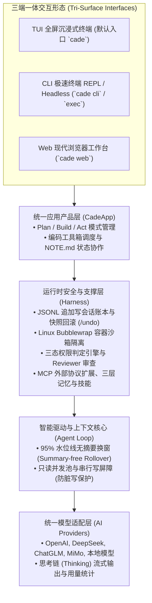
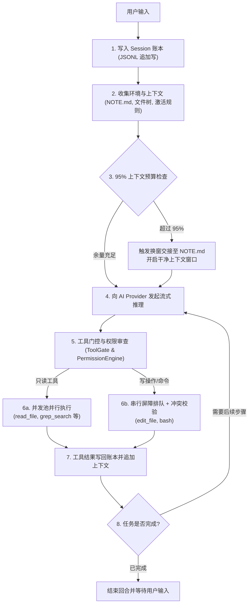

# 运行时架构与核心生命周期

Cade 绝不仅是一个局限于终端命令行的 CLI 工具，而是一个拥有**统一应用运行时内核（Unified Agent Harness）**、开箱即用支持 **TUI 全屏终端**、**CLI 极速交互** 与 **Web 浏览器工作台** 的现代 Coding Agent 平台。

---

## 1. 统一运行时内核与三端工作台架构

各层级职责自上而下严格解耦，应用内核通过统一装配工厂（Assembly）注入能力：

1. **三端一体交互层 (`src/cade/cli/`, `src/cade/server/`)**：
   - **TUI 工作台**（默认入口）：提供类 IDE 的全屏分屏视图与 Diff 实时审查看板；
   - **CLI REPL**：极轻量行交互，支持快捷键、`@` 文件补全、`!` 穿透与 CI 脚本自动化；
   - **Web 工作台**：基于 FastAPI 与 WebSocket 实时双向流，支持多端可视化管理。
2. **应用产品层 (`src/cade/coding_agent/`)**：
   承载与编码任务直接绑定的业务语义。管理 Plan/Build/Act 状态机、系统 Prompt 拼装与目标验收。
3. **运行时支撑与安全层 (`src/cade/harness/`)**：
   提供底层的安全与持久化地基。通过 Linux Bubblewrap 隔离 Shell 命令执行，通过追加写 JSONL 保证全量事实留存，并集成 MCP 外部协议。
4. **智能驱动与上下文核心 (`src/cade/agent/`)**：
   负责核心事件驱动循环。当上下文占满 95% 时触发换窗重置，并负责只读工具并发派发与写操作串行排队。
5. **统一模型适配层 (`src/cade/ai/`)**：
   抹平大模型服务商协议差异，原生支持深层思考链解析与 Token 统计。

---

## 2. 一次回合（Turn）的完整生命周期

当你在终端中敲下回车发送一条指令时，Cade 内部经历以下执行链条：

---

## 3. 核心设计原则

- **代码即真相**：所有运行时状态最终都可以由 Session JSONL 账本回放重构。
- **只读并发，写操作屏障**：只读工具大胆并行提高探索速度，写文件与 Shell 严格串行加锁并校验指纹，杜绝并发竞争与写坏文件。
- **无摘要换窗**：不使用 LLM 递归总结历史对话，避免总结丢失细节或产生幻觉；依托结构化的 `NOTE.md` 传承长任务进展。
