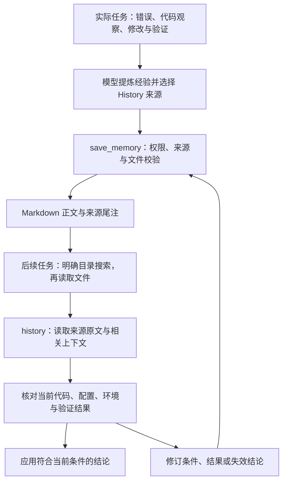

# Cade's Memory

Cade 的 Memory 是工作区 `.cade/memory/` 中的一组 Markdown 文件，保存经过较高
排查成本才获得、可能在后续任务中复用的知识。模型从实际任务中提炼条件、原因和
处理结果，显式引用会话证据；后续任务按需查找这些文件，回到来源并核对当前实现。

Memory 的收益取决于经验的复用次数、适用条件和核验成本。历史事件保存具体执行
事实，Memory 保存对这些事实的解释及再次使用的入口。本文说明当前实现的职责、
保存协议、调用示例、读取路径和验证范围；会话与请求预算的整体关系见
[架构说明](architecture.md)。

## 保存什么

适合保存的内容包括：多轮调查才定位的故障条件、依赖或环境造成的行为差异、容易
重复踩到的实现约束，以及经验证有效且适用条件明确的处理办法。正文应说明症状、
条件、原因、观察结果和核验入口，使后续任务能判断这条经验是否适用。

任务状态、固定规则和可复用方法各有存储位置，模型根据内容用途选择载体：

| 载体 | 保存内容 | 使用方式 |
|---|---|---|
| 代码、配置和测试 | 项目的当前实现与可重复验证 | 判断当前事实和行为 |
| 仓库指令，如 AGENTS.md | 项目约束与协作规则 | 作为项目指令参与任务 |
| NOTE.md | 当前目标、进展、验证状态和下一步 | 随上下文收集与换窗衔接任务 |
| Skills | 可反复执行的方法及参考资料 | 根据任务选择并加载 |
| Session History | 输入、模型响应、工具交互和运行事件 | 按分支搜索或按 ID 精确读取 |
| Memory | 有来源、可再次核验的工作区经验 | 按需搜索、读取、核验和修订 |

直接从当前文件即可获得的事实可在任务中即时读取。经验涉及多个环境或版本时，
正文应保留各自条件与观察结果；从有限样本推导出的原因应标明推断及核验方式。
来源引用提供检查材料，正文结论的成立范围需要结合材料判断。

## 从任务经验到后续复用



保存、检索和适用性判断由当前任务中的模型决定，用户也可明确要求复用某段经验。
宿主负责权限、路径、引用解析和文件提交，`save_memory` 内部只执行这些确定性
操作。模型推理发生在普通 Agent 循环中，保存后的工具结果按该循环的既有规则处理。

普通启动、任务请求和会话恢复发布固定的能力指引与工具 schema。Memory 内容在
显式搜索或读取时才进入工具结果，目录在首次保存时按需创建。`/memory` 显示目录
位置，文件搜索沿用已有 Shell 和文件读取工具。

## 文件与作用域

每条经验对应 `.cade/memory/` 中一个直接子文件，名称用于定位，例如
`.cade/memory/provider-timeout.md`。保存工具接受相对路径或工作区内的绝对路径，
要求 `.md` 后缀和非隐藏文件名，并检查 `.cade`、Memory 目录及目标文件的符号
链接。经验以普通文件维护，用户可通过编辑器修改或删除。

默认每个 clone 或 worktree 使用各自的 Memory 目录。复用范围由工作区文件决定，
经验的源记录保留在对应 Session 和 artifact 中。纳入 Git 的 Memory 可随仓库
传播，接收方仍需取得相关历史证据并检查当前条件；文件中的 Git SHA 可辅助定位
版本，未提交文件和当时环境需通过实际来源核对。

Memory 正文和来源的保存周期相互独立。默认会话日志位于 `.cade/sessions/`，
外置工具结果位于 `.cade/session_artifacts/`。删除被引用的 Session 或 artifact
后，经验文件仍可读取，来源查询会报告缺失或无效记录。迁移需要核验的经验时，
应同时保留被引用的会话日志与 artifact；当前持久内容以这些原始对象为依据。

## 保存协议与文件更新

[`save_memory`](../src/cade/harness/memory/tools.py) 由产品 registry 装配，调用参数
如下。

| 参数 | 要求 | 含义 |
|---|---|---|
| `path` | 必填字符串 | `.cade/memory/` 中的直接 Markdown 文件路径 |
| `markdown` | 必填非空字符串 | 自由格式正文，可包含读取所得的完整来源尾注 |
| `sources` | 必填非空数组 | 显式 History 引用，每项包含 `entry_id`，可提供 `session_id` |
| `expected_content` | 更新时提供字符串 | 完整旧文件文本，含已有来源尾注，作为写入前置条件 |

创建文件时提交如下参数，示例中的 ID 需替换为 `history` 返回的真实来源：

```json
{
  "path": ".cade/memory/provider-timeout.md",
  "markdown": "# Provider timeout\n\n记录实际症状、适用条件、原因或推断、处理结果，以及当前核验入口。",
  "sources": [
    {"session_id": "20260930-100000", "entry_id": "abc123def456"}
  ]
}
```

每个来源通过 History 的精确读取接口验证，省略的 `session_id` 绑定当前会话。
解析后的完整 entry ID 写入尾注，重复引用合并。校验会解析相关 artifact，缺失、
无效或越界来源使保存失败。正文的组织和结论由模型表达，宿主校验范围为非空文本、
来源可读取性、保留标记和文件大小。

最终文件的 UTF-8 大小上限为 1,000,000 字节。保存调用在目标目录取得文件锁，
等待上限为 10 秒，再读取当前文本与 `expected_content` 比较。创建文件时当前
内容与省略的前置条件均为空；更新时必须提供完整旧文本。冲突、来源错误和取消
会使提交停止，调用方重新读取后再决定如何修订。

文件内容写入同目录临时文件，刷写后提交；创建通过硬链接防止覆盖同期新建文件，
更新通过原子替换提交。文件锁协调 Cade 保存调用，外部编辑器采用各自的写入机制，
两者的并发编辑需要在使用时核对。正文的原子提交保障单次文件更新，来源校验与
外部文件修改之间的完整事务隔离超出当前实现范围。

## 来源尾注

宿主管理文件末尾的一块保留区域，内容来自当次显式 `sources`：

```markdown
<!-- cade:memory:sources -->
## Sources
- session_id=<会话 ID> entry_id=<记录 ID>
<!-- /cade:memory:sources -->
```

更新时可提交读取后的完整文件，宿主替换该区域并保留标记外的正文。仍需保留的
旧来源应包含在本次 `sources` 中。正文里的同名标题属于作者内容，按普通文本
保存；保留标记损坏、重复或尾注后存在正文时，工具报告错误。

尾注验证引用存在且可读取。来源可以是错误、代码观察、修改或验证事件，其证明
范围由原文内容决定。保存者应把结论对应到具体材料，读取者应核对材料是否支持
解释、当时条件与当前环境是否一致。

## 按需检索、读取与核验

模型需要历史经验时，通过 `bash` 对明确目录执行 `rg`，再用 `read` 读取匹配文件。
检索 Memory 时指定目录，例如：

```bash
rg "timeout" .cade/memory/
```

普通项目搜索保持其隐藏目录与 ignore 规则。读取内容作为普通 evidence 参与请求
准入，可被预算策略裁剪或回收，原始工具结果继续保存在会话事实中；分页和恢复
方式见 [上下文策略](context-policy.md)。

[`history`](../src/cade/harness/session/history.py) 提供 `session_id + entry_id` 精确
读取。显式指定会话可读取该会话中的原始条目，包括当前 head 之外的分支。
`around` 沿锚点的祖先读取邻域，此时使用 `before`；当前分支的邻域查询另支持
`after`。搜索范围为当前会话分支，跨会话证据通过已知来源 ID 定位。

按来源读取原文时使用如下参数，ID 同样替换为实际记录：

```json
{
  "operation": "read",
  "session_id": "20260930-100000",
  "entry_id": "abc123def456",
  "offset": 0,
  "max_chars": 8000
}
```

原文读取复用 artifact 与字符分页，`offset` 按字符计数，`max_chars` 默认 8000、
上限 20000。读取结果报告总长度和下一页位置，当前会话及 branch head 保持原状态。
预览用于定位，精确分页用于核验。请求中的分页结果被裁剪时，缩小页长并重读
同一偏移，确认内容完整后继续下一页。artifact 读取检查引用格式、UTF-8 文本、
字节与字符计数，文件缺失或校验失败时报告错误。

读取引用后，应检查当前相关代码、配置和环境，并运行与当前决策对应的验证。
经验条件变化时，更新正文、来源及核验入口；条件仍成立时，正文可继续使用。
维护直接作用于文件，修改历史由会话记录及已纳入版本控制的文件历史提供。

## 权限与工作区归属

`save_memory` 声明文件写入动作，受当前模式、`security.permissions.edit` 和具体
工具规则约束。主代理的内置 Build、Act 工具集合发布保存能力，Build 默认允许
此类写入，Act 默认请求审批；Plan 可通过文件与 Shell 工具按需读取经验。结构化
文件工具对 `.cade` 元数据执行写保护，Memory 路径例外绑定到 `save_memory`。
Shell 访问范围由命令权限判定与所选执行环境共同约束，`.cade` 的只读挂载保证
适用于默认 Linux sandbox；其他配置的范围和裁决顺序见
[架构说明](architecture.md#模式权限与执行环境)。

History 的显式来源读取按配置的 Session 存储位置检查归属。解析后的位置为当前
工作区 `.cade/sessions/` 时，以目录位置确定归属，工作区移动后可继续读取本地
历史。共享或自定义目录以日志首条记录中的绝对 `project_path` 核验归属，指向
外部位置的目录链接采用这一检查。

显式来源读取直接依据日志，归属判定来自目录或日志绑定；导航缓存
`session_index.json` 用于展示和查找入口。Session 文件路径同时接受存储边界检查，
明确 ID 的引用为经验提供可追溯入口，具体权限和归属校验由宿主执行。

## 实现入口与验证范围

| 位置 | 职责 |
|---|---|
| [memory/tools.py](../src/cade/harness/memory/tools.py) | 保存 schema、路径、来源尾注、冲突与原子提交 |
| [session/history.py](../src/cade/harness/session/history.py) | 精确来源、祖先邻域、分页与工作区归属 |
| [session/artifacts.py](../src/cade/harness/session/artifacts.py) | 完整工具结果的外置存储与读取校验 |
| [assembly/registry.py](../src/cade/coding_agent/assembly/registry.py) | History 与保存工具的产品装配 |
| [permission_model/](../src/cade/harness/security/permission_model/) | 写入动作与受保护元数据的路径例外 |
| [test_memory_history.py](../src/cade/tests/test_memory_history.py) | 来源、冲突、尾注、历史迁移与 artifact 的回归检查 |

现有回归用例覆盖文件保存、冲突拒绝、尾注替换、来源精确读取和工作区边界，
执行环境与验证命令见 [测试指南](testing.md)。Memory 对任务表现的收益需要单独
评估：保持模型、任务和 History 能力一致，比较重复问题、条件变化和无关任务的
表现，并计入保存、检索、核验和未复用文件的成本。
