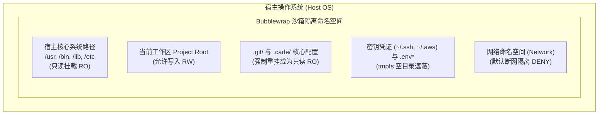

# 权限、安全与 Linux Sandbox 隔离

作为可以在开发者本地执行 Shell 与修改文件的工具，Cade 在架构层将**纵深防御（Defense-in-Depth）**置于首位。即使模型受到恶意 Prompt 注入攻击，多层安全防线也能确保宿主系统与核心资产不受侵害。

---

## 1. Linux Bubblewrap (bwrap) 沙箱隔离

在 Linux 环境下，当 Cade 执行 `bash` 工具时，默认通过 `bubblewrap` 容器化沙箱技术启动隔离进程：

### 1.1 沙箱四大安全铁律

1. **宿主只读保护**：沙箱中宿主系统的 `/bin`、`/usr`、`/etc` 等核心路径均为只读，`rm -rf /` 或覆写系统库在沙箱内绝对无效。
2. **版本库防篡改**：工作区根目录虽然可写，但工作区下的 `.git/` 与 `.cade/` 目录会被**重新以只读（Read-Only）挂载覆盖**。Agent 即使误执行了 `rm -rf *`，版本控制树也绝对安全。
3. **敏感凭证深度遮蔽（Credential Masking）**：
   - 宿主用户的敏感目录（如 `~/.ssh/`、`~/.aws/`、`~/.gnupg/`、`~/.config/gcloud/`）在沙箱内会被空白 `tmpfs` 遮盖，读取结果为空；
   - 工作区内的 `.env`、`.env.local` 等敏感密钥文件在沙箱中同样被遮蔽阻断，彻底消除 Agent 将密钥意外读取或泄露给模型的风险。
4. **默认断网（Network Isolation）**：沙箱内部默认解除网络命名空间绑定。如果测试需要联网下载依赖，可通过配置将 `network_access` 设置为 `allow`。

---

## 2. 三态权限控制（Permission Engine）

Cade 内部实现了一套严密的权限决策引擎，所有工具调用必须经过权限裁决：

- **`allow`（放行）**：直接执行。例如在 `build` 模式下修改项目代码。
- **`ask`（询问确认）**：在终端向人类用户弹出清晰的拟执行动作与入参，只有用户在终端敲击确认后才会执行。
- **`deny`（拦截）**：直接阻断并向模型返回错误提示。例如在 `plan` 模式下试图修改 `.py` 文件。

---

## 3. 自动语义审查器（Reviewer）

在 `build` 模式下，为了让开发流程自动化进行，同时避免危险的 Shell 操作，Cade 引入了独立的 **Reviewer 审查器**：

- 当 Agent 尝试运行命令（如 `uv run pytest`）时，Reviewer 首先会进行规则模式匹配；
- 对于不在白名单中的未知 Shell 指令，会通过内置轻量模型进行自动安全评估；
- 包含高危操作（如格式化磁盘、修改系统服务、向外泄露数据等命令）会被审查器拦截或自动降级为向用户申请人工审批（Ask），杜绝失控。
